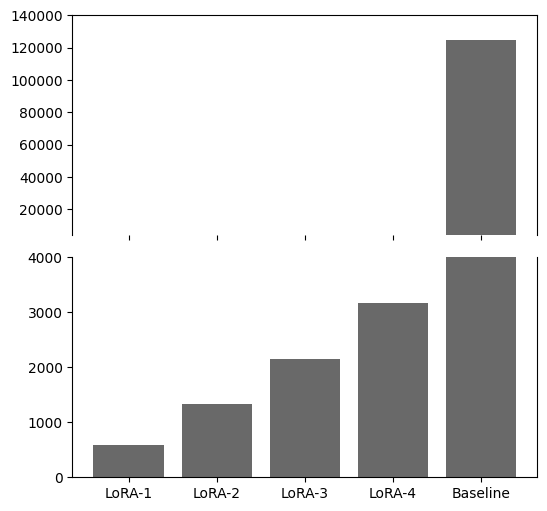
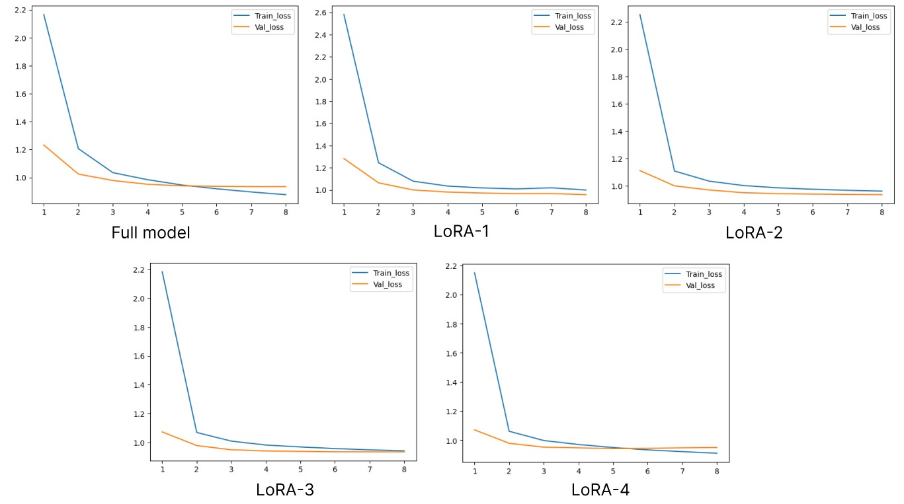
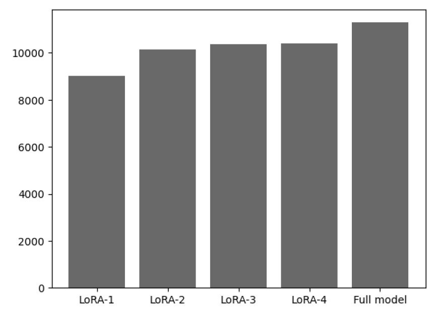
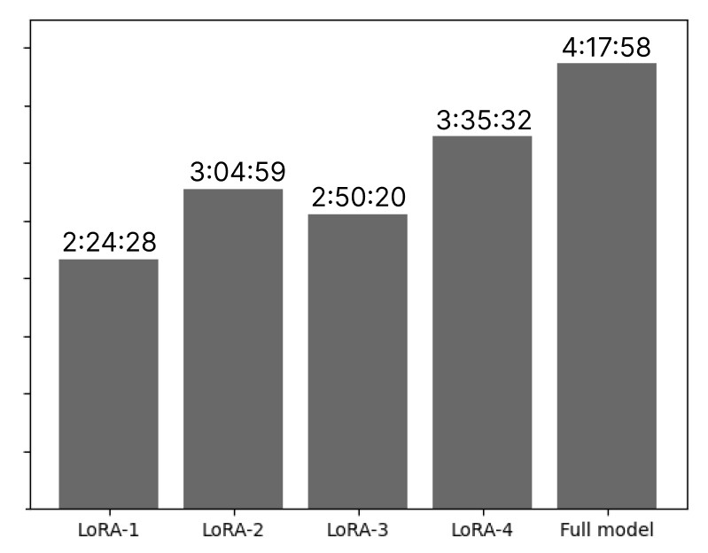

# Comparing traditional fine-tuning to LoRA
[]

The objective of this work is to compare LoRA fine-tuning with the traditional approach and evaluate their respective performances.

__The results of the study are presented in report.pdf__

## Table of Contents

- [Used models](#Models)
- [Results](#Results)
- [Reproducibility](#Reproducibility)
- [License](#License)

## Models

This study uses GPT-2 model from HuggingFace hub, it can be found [here](https://huggingface.co/openai-community/gpt2).
This model is fine-tuned on the [WikiText-2](https://huggingface.co/datasets/Salesforce/wikitext) dataset and compard to LoRA-[1-4] models such as:

- LoRA-1 has only attention LoRA layer;
- LoRA-2 has attention and projection LoRA layers;
- LoRA-3 has attention, projection, and feed-forward LoRA layers;
- LoRA-4 includes attention, projection, feed-forward, and output LoRA layers.

The difference in amount of trainable parameters is presented here:

## Results

All the models were trained during 8 epochs, here are the training and validation loss graphs:

The models were trained using a single Nvidia RTX 3060 GPU with 12 GB of VRAM. Due to this limitation, the sequence lengths were set to 350, and the batch size was limited to 14, with gradient accumulation every 5 steps. The following graph shows the maximum amount of allocated memory during training in megabytes:

And here is the time required to fine tune each model (in H:MM:SS format).

## Reproducibility

In order to reproduce the results, please make sure that you've installed the packages listed in __requirements.txt__.

After that, you can simply run `python train.py` and will run the full model fine-tuning pipeline. 

To train LoRA models, just pass the flag `-l`:
`python train.py -l`

By default, it will train the LoRA-4 model, but it can be changed in **config.py** by selecting a different set of `target_modules`. 

The pipeline will create two folders to store fine-tuned weights and logs: *weights/* and *runs/* respectively.

This project uses Tensorboard, so you can monitor all the necessary information by running
`tensorboard --logdir runs`

## License
This project uses MIT Licence.